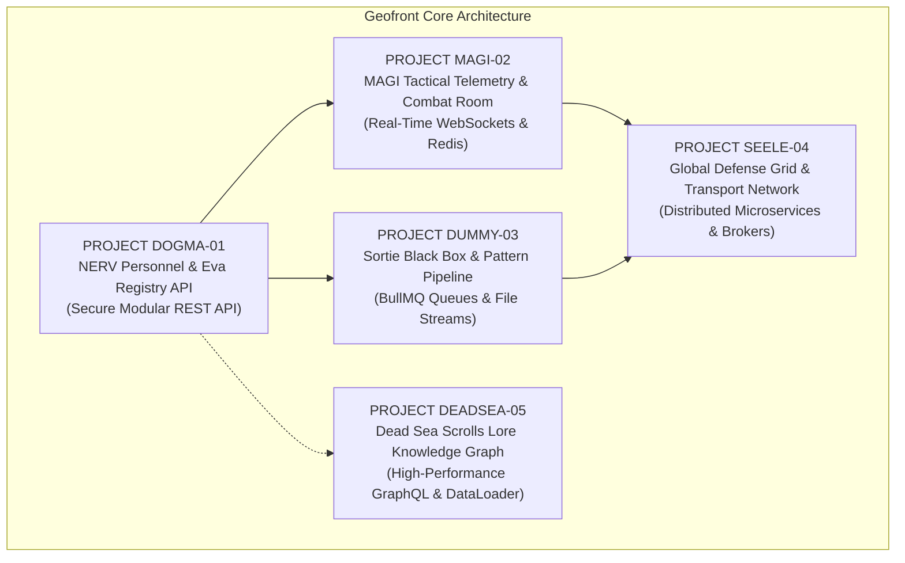

# NERV Tactical System — Project Specifications

This document defines the 5 official engineering projects built on NestJS, themed around the **Neon Genesis Evangelion / NERV Central Dogma** tactical universe. 

Each project serves as a concrete implementation of the milestones in [roadmap.md](file:///C:/Genesis/Quattro/project-nestjs/roadmap.md) and verifies specific concept clusters from [checklist.md](file:///C:/Genesis/Quattro/project-nestjs/checklist.md).

---

## Systems Overview



---

## Project 1: `PROJECT DOGMA-01`
### NERV Headquarters Personnel & Eva Registry API

* **Operational Role:** The primary administrative and security backbone for NERV Central Dogma.
* **Architecture:** Production-Grade Modular Monolithic REST API.
* **Roadmap Link:** [`Project 1: Secure Multi-Tenant REST API`](file:///C:/Genesis/Quattro/project-nestjs/roadmap.md#L28-L56)
* **Checklist Coverage:** [`Sections 1 through 11`](file:///C:/Genesis/Quattro/project-nestjs/checklist.md#L7-L140)

#### 1. Tactical Briefing
NERV requires an uncompromised, role-restricted REST API to manage personnel, pilots (the "Children"), Evangelion units, and classified sortie logs. Security clearance must be strictly enforced—pilots cannot access classified Eva soul-transmutation logs, while the Supreme Commander holds absolute clearance.

#### 2. Security Roles & Access Control
* `SUPREME_COMMANDER` (Gendo Ikari): Unrestricted access to all entities, dummy plug configurations, and classified records.
* `TACTICAL_CHIEF` (Misato Katsuragi): Read/write access to sortie logs, launch readiness, and pilot assignment.
* `CHIEF_SCIENTIST` (Ritsuko Akagi): Full management of Eva synchronization histories and biological data.
* `CHILDREN_PILOT` (Shinji, Asuka, Rei): Read-only access to their own synchronization rates and assigned units.

#### 3. Core Domain Entities & Relational Schema
* **Pilot:** `id`, `name` (Shinji Ikari, Rei Ayanami, etc.), `bloodType`, `assignedEvaId`, `clearanceLevel`, `syncHistory`.
* **EvaUnit:** `id`, `unitDesignation` (Unit-00, Unit-01, Unit-02), `operationalStatus` (`STANDBY`, `DEPLOYED`, `BERSERK`, `CONTAINED`), `soulSignature`, `currentSyncRate`.
* **SortieRecord:** `id`, `missionCodename`, `angelTarget` (e.g., Sachiel, Ramiel), `deployedEvaId`, `pilotId`, `durationSeconds`, `outcome` (`VICTORY`, `DEFEAT`, `ABORTED`).

#### 4. Technical Deliverables
- [ ] **Bootstrap & Architecture:** Clean modular architecture (`AuthModule`, `PersonnelModule`, `EvaModule`, `SortieModule`).
- [ ] **Validation & DTOs:** Strict payload validation via `class-validator` (validating sync rate floats between `0.0` and `400.0%`, blood types like `A`, `B`, `AB`, `O`, `BLUE`).
- [ ] **Persistence:** PostgreSQL with Prisma or TypeORM, including seed files populating pilots, units, and base personnel.
- [ ] **Security:** JWT authentication with access/refresh tokens; `@Roles()` and `@Clearance()` decorators enforced via `AuthGuard`.
- [ ] **Interactive API Contract:** Fully documented endpoints using `@nestjs/swagger` at `/api/docs`.
- [ ] **Automated Testing:** Unit tests for synchronization calculation logic; E2E tests verifying forbidden pilot access to commander routes (`403 Forbidden`).

---

## Project 2: `PROJECT MAGI-02`
### MAGI Tactical Telemetry & Combat Room

* **Operational Role:** Real-time tactical tracking and consensus decision-making during Angel incursions into Tokyo-3.
* **Architecture:** Real-Time WebSocket Gateway + Redis In-Memory State & Caching.
* **Roadmap Link:** [`Project 2: Real-Time Collaborative Engine`](file:///C:/Genesis/Quattro/project-nestjs/roadmap.md#L58-L81)
* **Checklist Coverage:** [`Sections 12, 13, 14`](file:///C:/Genesis/Quattro/project-nestjs/checklist.md#L141-L181)

#### 1. Tactical Briefing
When an Angel appears, standard HTTP polling is too slow. Central Dogma's tactical display requires instant, bi-directional telemetry streaming between Eva cockpits, the command deck, and the tripartite supercomputer **MAGI** (`Melchior-1`, `Balthasar-2`, `Casper-3`).

#### 2. Key Telemetry Streams & State Machine
* **Pilot Synchronization Fluctuation:** Real-time percentage shifts broadcasted every 500ms over WebSocket rooms.
* **5-Minute Internal Battery Countdown:** Automated stateful timer activated upon umbilical cable disconnection (`STATUS: UNPLUGGED`).
* **MAGI 3-Way Consensus Engine:** Real-time voting resolution. Each of the three biological computers submits its independent vote (`AGREE`, `DENY`, `CONDITIONAL`). Unanimous or majority resolution is emitted to clients.
* **Tokyo-3 Defense Alert State:** Tokyo-3 alert broadcast (`NORMAL` $\rightarrow$ `CONDITION_YELLOW` $\rightarrow$ `EMERGENCY_STATE_RED`).

#### 3. Technical Deliverables
- [ ] **WebSocket Gateway (`@WebSocketGateway`):** Authenticated socket connections using JWT tokens; room partitioning per Eva cockpit (`/room/eva-01`, `/room/command-deck`).
- [ ] **Redis In-Memory Store:** High-frequency pilot vitals and Angel spatial coordinates stored in Redis for instant lookups.
- [ ] **In-Process Decoupling:** Use `@nestjs/event-emitter` to broadcast events like `EvaWentBerserkEvent` or `UmbilicalSeveredEvent`.
- [ ] **Cron Tasks:** Scheduled tasks using `@nestjs/schedule` to poll Tokyo-3 sensor health and clear stale connection sockets.

---

## Project 3: `PROJECT DUMMY-03`
### NERV Classified Ingestion & Pattern Analysis Pipeline

* **Operational Role:** Non-blocking processing of massive combat recordings, Eva flight recorders, and biological scans.
* **Architecture:** Distributed Background Queues (`BullMQ` + Redis) + Streaming File Ingestion.
* **Roadmap Link:** [`Project 3: Background Job & Pipeline Worker`](file:///C:/Genesis/Quattro/project-nestjs/roadmap.md#L83-L109)
* **Checklist Coverage:** [`Sections 4, 12, 14`](file:///C:/Genesis/Quattro/project-nestjs/checklist.md#L40)

#### 1. Tactical Briefing
Eva sorties generate multi-gigabyte telemetry and video logs. Directly processing these in HTTP requests would block the main server thread and crash Central Dogma during critical operations. An asynchronous pipeline handles ingestion, pattern analysis, and automated report generation.

#### 2. Pipeline Stages
1. **Ingestion (Producer):** HTTP multipart file upload for sortie black box logs (CSV/JSON) and cockpit dashcam feeds (video/audio). Returns an immediate `202 Accepted` with a `JobId`.
2. **Analysis Worker (Consumer):** Parses the telemetry stream to identify waveform signatures (e.g., verifying `Blood Type: Blue`).
3. **Report Generation:** Generates classified debrief PDF summaries and extracts key frame snapshots.
4. **SSE Dispatcher:** Pushes live progress updates (`JobId: 45% - Analyzing AT-Field Harmonics...`) via Server-Sent Events (SSE).

#### 3. Technical Deliverables
- [ ] **Streaming File Uploads:** Memory-efficient stream handling with MIME and file size validation.
- [ ] **Queue Architecture:** `@nestjs/bullmq` producers and consumers with Redis backing.
- [ ] **Fault Tolerance:** Configured exponential backoff retries and Dead-Letter Queues (DLQ) for corrupted flight logs.
- [ ] **Lifecycle Shutdown Hooks:** Implement `onApplicationShutdown` so active analysis jobs are safely finished or paused without data corruption during server restarts.

---

## Project 4: `PROJECT SEELE-04`
### Global NERV Defense Grid & Tactical Microservices

* **Operational Role:** Distributed coordination across worldwide bases (Tokyo-3 HQ, Bethany Base, Matsushiro Base, and the SEELE Committee).
* **Architecture:** Event-Driven Distributed Microservices (RabbitMQ / gRPC + Docker).
* **Roadmap Link:** [`Project 4: Distributed Microservices Architecture`](file:///C:/Genesis/Quattro/project-nestjs/roadmap.md#L111-L140)
* **Checklist Coverage:** [`Sections 13, 14, 15`](file:///C:/Genesis/Quattro/project-nestjs/checklist.md#L154-L194)

#### 1. Tactical Briefing
No single monolithic server can coordinate global operations across continents. NERV requires independent, decoupled microservices connected by high-speed message brokers, ensuring that if a foreign base goes dark, Tokyo-3 remains completely operational.

#### 2. Microservice Topology
```
           [ Client / Tactical Terminal ]
                         │ HTTP
                         ▼
        ┌───────────────────────────────────┐
        │       NERV Gateway Service        │
        └───────────────────────────────────┘
                         │
         ┌───────────────┴───────────────┐
         │ RabbitMQ / gRPC Message Bus   │
         └───────────────┬───────────────┘
                         │
         ┌───────────────┼───────────────┐
         ▼                               ▼
┌─────────────────────────┐   ┌─────────────────────────┐
│ Tokyo-3 Catapult Launch │   │    SEELE Scenario &     │
│   & Power Grid Service  │   │  Dead Sea Compliance    │
└─────────────────────────┘   └─────────────────────────┘
```

* **Service A (Gateway Service):** Public entrypoint for tactical command requests.
* **Service B (Catapult & Linear Rail Service):** Manages launch silos, emergency evacuation shafts, and power distribution grids.
* **Service C (SEELE Compliance Service):** Audits mission outcomes against the Human Instrumentality scenario script.

#### 3. Technical Deliverables
- [ ] **Transporter Configuration:** Connect services using `@nestjs/microservices` with RabbitMQ or gRPC.
- [ ] **Transactional Outbox Pattern:** Ensure launch commands are guaranteed to persist and publish even during broker disconnects.
- [ ] **Circuit Breakers:** Implement resilience patterns so failure of the SEELE audit service does not prevent Eva launches.
- [ ] **Docker Orchestration:** Multi-stage `Dockerfile` and `docker-compose.yml` spinning up all 3 services, RabbitMQ, and databases.
- [ ] **Health Checks:** Comprehensive readiness/liveness probes via `@nestjs/terminus`.

---

## Project 5: `PROJECT DEADSEA-05`
### The Dead Sea Scrolls Lore & Ancestral Knowledge Graph

* **Operational Role:** High-performance, deeply linked knowledge graph indexing Angels, Ancestral Lore, Eva souls, and historical Impacts.
* **Architecture:** Code-First GraphQL Gateway + DataLoader.
* **Roadmap Link:** [`Project 5: High-Performance GraphQL Gateway`](file:///C:/Genesis/Quattro/project-nestjs/roadmap.md#L142-L166)
* **Checklist Coverage:** [`Sections 5 & 13`](file:///C:/Genesis/Quattro/project-nestjs/checklist.md#L56-L166)

#### 1. Tactical Briefing
Researchers at Gehirn and NERV need to query deeply intertwined historical events, Angel lineages, and organizational records. Standard REST endpoints require dozens of repetitive network calls to fetch nested relations. A GraphQL gateway allows clients to query exactly the slice of lore they need.

#### 2. Schema Hierarchy & Nested Graph
```
Angel (Sachiel, Ramiel, etc.)
  └── First Encounter (Date, Location: Geofront)
  └── Defeated By (Eva Unit-01)
        └── Pilot (Shinji Ikari)
              └── Psychological Profile
              └── Assigned Organization (NERV)
```

#### 3. Technical Deliverables
- [ ] **Code-First GraphQL:** Define schema entirely via TypeScript decorators (`@ObjectType()`, `@Field()`, `@Resolver()`, `@Query()`, `@Mutation()`).
- [ ] **DataLoader Optimization:** Implement batching with `DataLoader` to eliminate the $N+1$ query bottleneck when resolving nested Angel $\rightarrow$ Eva $\rightarrow$ Pilot chains.
- [ ] **Security & Guards:** Field-level permissions redacting forbidden Dead Sea Scrolls prophecies unless an authorized clearance token is supplied.
- [ ] **GraphQL Subscriptions:** Real-time alerts when new classified lore or research papers are published.

---

## Traceability Matrix

| Project | Primary Focus | Checklist Reference | Roadmap Section |
| :--- | :--- | :--- | :--- |
| **`PROJECT DOGMA-01`** | REST, Auth, ORM, DTOs, Testing | [Sections 1–11](file:///C:/Genesis/Quattro/project-nestjs/checklist.md#L7-L140) | [Project 1](file:///C:/Genesis/Quattro/project-nestjs/roadmap.md#L28-L56) |
| **`PROJECT MAGI-02`** | WebSockets, Redis, Events, Cron | [Sections 12–14](file:///C:/Genesis/Quattro/project-nestjs/checklist.md#L141-L181) | [Project 2](file:///C:/Genesis/Quattro/project-nestjs/roadmap.md#L58-L81) |
| **`PROJECT DUMMY-03`** | BullMQ, Streams, File Uploads, SSE | [Sections 4, 12, 14](file:///C:/Genesis/Quattro/project-nestjs/checklist.md#L40) | [Project 3](file:///C:/Genesis/Quattro/project-nestjs/roadmap.md#L83-L109) |
| **`PROJECT SEELE-04`** | Microservices, RabbitMQ, Docker | [Sections 13–15](file:///C:/Genesis/Quattro/project-nestjs/checklist.md#L154-L194) | [Project 4](file:///C:/Genesis/Quattro/project-nestjs/roadmap.md#L111-L140) |
| **`PROJECT DEADSEA-05`** | GraphQL, DataLoader, Resolvers | [Sections 5 & 13](file:///C:/Genesis/Quattro/project-nestjs/checklist.md#L56-L166) | [Project 5](file:///C:/Genesis/Quattro/project-nestjs/roadmap.md#L142-L166) |
