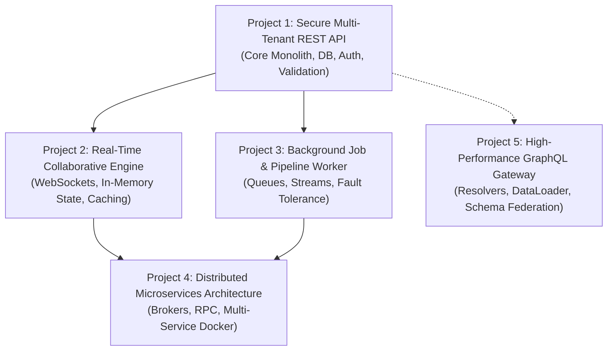

# NestJS Project-Based Learning Roadmap

This roadmap translates the master inventory in [checklist.md](file:///C:/Genesis/Quattro/project-nestjs/checklist.md) into **5 progressive, production-grade projects**.

For full tactical specifications, schemas, endpoints, and role hierarchies, see the detailed project dossiers in [projects.md](file:///C:/Genesis/Quattro/project-nestjs/projects.md).

---

## Roadmap Progression

---

## Project 1: Secure Multi-Tenant REST API

* **Concept:** A production-ready **Task & Issue Management API** (similar to Linear / Jira) featuring organizations, role-based access control, relational persistence, and interactive documentation.
* **Primary Objective:** Master standard server-side application development, clean request handling, database modeling, and authentication.

### Key Deliverables
- [ ] Bootstrap project structure with Nest CLI and setup modular architecture (`UsersModule`, `AuthModule`, `ProjectsModule`, `TasksModule`).
- [ ] Implement DTOs with runtime payload validation and class transformation.
- [ ] Connect a relational database using an ORM (Prisma / TypeORM) with schema migrations and seed scripts.
- [ ] Implement user authentication with password hashing (bcrypt), JWT access/refresh tokens, and HTTP cookies/headers.
- [ ] Enforce route authorization using Guards for roles (`ADMIN`, `MEMBER`, `VIEWER`).
- [ ] Provide unified error handling using custom exception filters and standard response envelopes.
- [ ] Generate interactive Swagger/OpenAPI documentation.
- [ ] Write unit tests for core services and end-to-end (E2E) tests for the auth/tasks routes.

### Linked Checklist Sections
* **Foundations & Structure:** [`Section 2. NestJS foundations`](file:///C:/Genesis/Quattro/project-nestjs/checklist.md#L15-L24)
* **Dependency Injection:** [`Section 3. Modules and dependency injection`](file:///C:/Genesis/Quattro/project-nestjs/checklist.md#L25-L39)
* **HTTP & Routing:** [`Section 4. Controllers and HTTP APIs`](file:///C:/Genesis/Quattro/project-nestjs/checklist.md#L40-L55)
* **Request Lifecycle:** [`Section 5. Request pipeline and cross-cutting components`](file:///C:/Genesis/Quattro/project-nestjs/checklist.md#L56-L68)
* **Input Validation & Errors:** [`Section 6. Validation, transformation, and errors`](file:///C:/Genesis/Quattro/project-nestjs/checklist.md#L69-L80)
* **Environment Config:** [`Section 7. Configuration and application setup`](file:///C:/Genesis/Quattro/project-nestjs/checklist.md#L81-L91)
* **Database & ORM:** [`Section 8. Data persistence`](file:///C:/Genesis/Quattro/project-nestjs/checklist.md#L92-L104)
* **Auth & Security:** [`Section 9. Authentication and security`](file:///C:/Genesis/Quattro/project-nestjs/checklist.md#L105-L119)
* **Testing:** [`Section 10. Testing and code quality`](file:///C:/Genesis/Quattro/project-nestjs/checklist.md#L120-L131)
* **API Documentation:** [`Section 11. API documentation and serialization`](file:///C:/Genesis/Quattro/project-nestjs/checklist.md#L132-L140)

---

## Project 2: Real-Time Collaborative & Event Engine

* **Concept:** A **Live Team Chat & Presence System** (similar to Slack / Discord channels) with instant messaging, typing indicators, user presence, and cached message feeds.
* **Primary Objective:** Master stateful WebSockets, in-memory data caching, and decoupled internal event dispatching.

### Key Deliverables
- [ ] Build a WebSocket Gateway (`@WebSocketGateway()`) supporting rooms and namespaces.
- [ ] Authenticate WebSocket handshakes using existing JWT tokens.
- [ ] Implement real-time channel communication: join room, leave room, send message, broadcast typing events.
- [ ] Track online/offline presence using Redis key-value storage.
- [ ] Cache recent channel history in Redis with TTLs and automatic cache invalidation on new posts.
- [ ] Decouple domain events (e.g., `UserJoinedEvent`, `NewMentionEvent`) using `@nestjs/event-emitter`.
- [ ] Schedule recurring clean-up tasks (e.g., clear stale presence markers every 5 minutes) using `@nestjs/schedule`.

### Linked Checklist Sections
* **In-Process Events:** [`Section 12. Events and event emitters`](file:///C:/Genesis/Quattro/project-nestjs/checklist.md#L147)
* **Caching with Redis:** [`Section 12. Caching: cache keys, TTLs, invalidation`](file:///C:/Genesis/Quattro/project-nestjs/checklist.md#L144)
* **Scheduled Cron Jobs:** [`Section 12. Scheduling recurring and delayed tasks`](file:///C:/Genesis/Quattro/project-nestjs/checklist.md#L145)
* **WebSockets & Gateways:** [`Section 13. WebSockets: gateways, adapters, rooms, auth`](file:///C:/Genesis/Quattro/project-nestjs/checklist.md#L160)
* **Domain Organization:** [`Section 14. Organizing by feature/domain`](file:///C:/Genesis/Quattro/project-nestjs/checklist.md#L169)

---

## Project 3: Background Job & Pipeline Worker

* **Concept:** An **Asynchronous Document & Media Processing Service** where users upload raw assets (large CSVs, PDFs, images), and workers process, transform, and deliver results asynchronously.
* **Primary Objective:** Master non-blocking background queue architectures, stream/file manipulation, retries, and graceful shutdown.

### Key Deliverables
- [ ] Handle multipart file uploads with size and MIME-type validation.
- [ ] Integrate a distributed queue system using `@nestjs/bullmq` with Redis.
- [ ] Implement Producers (controllers that enqueue jobs instantly and return `202 Accepted` with a job ID).
- [ ] Implement Consumers (processors that parse CSVs, generate summary reports, resize images).
- [ ] Implement progress tracking, exponential retry backoff, and dead-letter queue (DLQ) handling.
- [ ] Expose an endpoint to poll or stream job progress (using Server-Sent Events / SSE).
- [ ] Implement application lifecycle hooks (`onApplicationShutdown`) to cleanly drain active jobs before termination.

### Linked Checklist Sections
* **File Uploads & Streams:** [`Section 4 & 12. File upload/download, streaming, storage limits`](file:///C:/Genesis/Quattro/project-nestjs/checklist.md#L53) & [`L149`](file:///C:/Genesis/Quattro/project-nestjs/checklist.md#L149)
* **Queues & BullMQ:** [`Section 12. Queues and background jobs: producers, consumers, retries`](file:///C:/Genesis/Quattro/project-nestjs/checklist.md#L146)
* **Server-Sent Events:** [`Section 4. Server-sent events and streaming`](file:///C:/Genesis/Quattro/project-nestjs/checklist.md#L53)
* **Graceful Shutdown:** [`Section 12. Graceful shutdown and connection cleanup`](file:///C:/Genesis/Quattro/project-nestjs/checklist.md#L152)
* **Idempotency & Resilience:** [`Section 14. Resilience: retries, dead-letter, idempotency`](file:///C:/Genesis/Quattro/project-nestjs/checklist.md#L175-L176)

---

## Project 4: Distributed Microservices Architecture

* **Concept:** A scalable **E-Commerce Order & Fulfillment System** split into 3 independent microservices communicating via message brokers and RPC.
* **Primary Objective:** Master distributed architecture, message brokers, cross-service transactions, and containerized deployment.

### Key Deliverables
- [ ] Create 3 coordinated services:
  * **API Gateway Service:** Public HTTP REST endpoints, request validation, routing.
  * **Order Service:** Manages checkout and order lifecycle state machine.
  * **Payment / Inventory Service:** Processes payments and reserves stock.
- [ ] Connect services using NestJS Microservices transport (RabbitMQ, Kafka, or gRPC).
- [ ] Implement request-response patterns (`ClientProxy.send()`) and event-driven broadcast patterns (`ClientProxy.emit()`).
- [ ] Implement the Transactional Outbox Pattern to guarantee message delivery during network drops.
- [ ] Implement circuit breaker and timeout patterns to prevent cascading failures.
- [ ] Containerize all services and brokers using Docker and `docker-compose`.
- [ ] Configure health checks (readiness/liveness probes) using `@nestjs/terminus`.

### Linked Checklist Sections
* **Microservices Transporters:** [`Section 13. Microservices: transporters, brokers (RabbitMQ/Kafka/gRPC)`](file:///C:/Genesis/Quattro/project-nestjs/checklist.md#L161-L164)
* **Hybrid Applications:** [`Section 13. Hybrid applications (HTTP + Microservice)`](file:///C:/Genesis/Quattro/project-nestjs/checklist.md#L164)
* **Distributed Patterns:** [`Section 14. CQRS, outbox pattern, circuit breakers, distributed locks`](file:///C:/Genesis/Quattro/project-nestjs/checklist.md#L174-L178)
* **Health Probes:** [`Section 12. Health checks, readiness/liveness probes`](file:///C:/Genesis/Quattro/project-nestjs/checklist.md#L150)
* **Containerization & CI:** [`Section 15. Docker multi-stage builds, process management, deployment`](file:///C:/Genesis/Quattro/project-nestjs/checklist.md#L182-L194)

---

## Project 5: High-Performance GraphQL Gateway

* **Concept:** A **Headless CMS & Content Publishing API** providing a flexible GraphQL interface for authors, articles, categories, and analytics.
* **Primary Objective:** Master GraphQL in NestJS, code-first schema generation, and solving data fetching bottlenecks.

### Key Deliverables
- [ ] Integrate `@nestjs/graphql` and Apollo Server in **Code-First** mode using TypeScript decorators.
- [ ] Define ObjectTypes, Inputs, Enums, Queries, and Mutations.
- [ ] Secure mutations with GraphQL-compatible authentication and role guards.
- [ ] Implement **DataLoader** to solve the $N+1$ query problem when resolving nested entity relations (e.g., Article $\rightarrow$ Author).
- [ ] Implement custom scalar types (e.g., `DateTime`, `JSON`).
- [ ] Set up GraphQL subscriptions for real-time publishing alerts.

### Linked Checklist Sections
* **GraphQL Basics:** [`Section 13. GraphQL: code-first vs schema-first, resolvers, queries, mutations`](file:///C:/Genesis/Quattro/project-nestjs/checklist.md#L158)
* **GraphQL Performance & DataLoader:** [`Section 13. DataLoader/N+1 prevention, subscriptions, schema complexity`](file:///C:/Genesis/Quattro/project-nestjs/checklist.md#L159)
* **Custom Execution Context:** [`Section 5. ExecutionContext and ArgumentsHost for GraphQL`](file:///C:/Genesis/Quattro/project-nestjs/checklist.md#L65)

---

## Complete Coverage Verification

| Project | Focus | Covered Checklist Sections |
| :--- | :--- | :--- |
| **Project 1** | Monolithic REST, DB, Auth, Testing | [1](file:///C:/Genesis/Quattro/project-nestjs/checklist.md#L7), [2](file:///C:/Genesis/Quattro/project-nestjs/checklist.md#L15), [3](file:///C:/Genesis/Quattro/project-nestjs/checklist.md#L25), [4](file:///C:/Genesis/Quattro/project-nestjs/checklist.md#L40), [5](file:///C:/Genesis/Quattro/project-nestjs/checklist.md#L56), [6](file:///C:/Genesis/Quattro/project-nestjs/checklist.md#L69), [7](file:///C:/Genesis/Quattro/project-nestjs/checklist.md#L81), [8](file:///C:/Genesis/Quattro/project-nestjs/checklist.md#L92), [9](file:///C:/Genesis/Quattro/project-nestjs/checklist.md#L105), [10](file:///C:/Genesis/Quattro/project-nestjs/checklist.md#L120), [11](file:///C:/Genesis/Quattro/project-nestjs/checklist.md#L132) |
| **Project 2** | Real-Time, WebSockets, Cache, Events | [12](file:///C:/Genesis/Quattro/project-nestjs/checklist.md#L141), [13](file:///C:/Genesis/Quattro/project-nestjs/checklist.md#L154), [14](file:///C:/Genesis/Quattro/project-nestjs/checklist.md#L167) |
| **Project 3** | Background Queues, File Streams, Retries | [4](file:///C:/Genesis/Quattro/project-nestjs/checklist.md#L40), [12](file:///C:/Genesis/Quattro/project-nestjs/checklist.md#L141), [14](file:///C:/Genesis/Quattro/project-nestjs/checklist.md#L167) |
| **Project 4** | Microservices, Brokers, Docker, Reliability | [13](file:///C:/Genesis/Quattro/project-nestjs/checklist.md#L154), [14](file:///C:/Genesis/Quattro/project-nestjs/checklist.md#L167), [15](file:///C:/Genesis/Quattro/project-nestjs/checklist.md#L182) |
| **Project 5** | GraphQL Code-First, Resolvers, DataLoader | [5](file:///C:/Genesis/Quattro/project-nestjs/checklist.md#L56), [13](file:///C:/Genesis/Quattro/project-nestjs/checklist.md#L154) |
